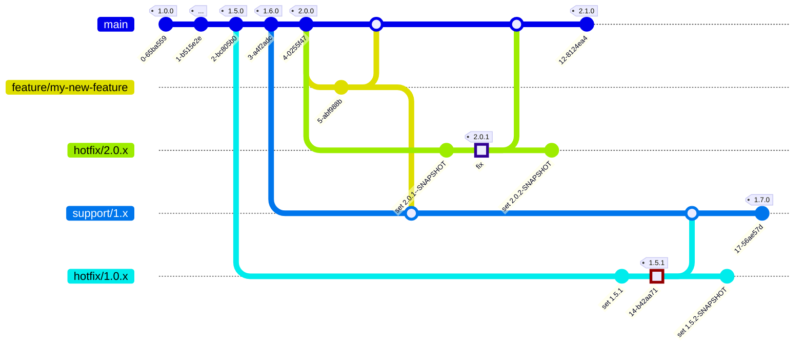


## Branching Model

After many years of experience with [GitFlow](http://nvie.com/posts/a-successful-git-branching-model/), we came to the conclusion that we needed a more lightweight workflow. The motivations for this are summarized in [Motivations for a more lightweight workflow](#motivations-for-a-more-lightweight-workflow).



TODO: `merge hotfix/1.0.x -> cherry-pick id:"the fixx"`, see [this pull request](https://github.com/mermaid-js/mermaid/pull/3115)

### `main`-branch

In our Branching model, the `main` branch is used to hold all release-enabled features. The `main` branch should be ready for a new release at any time.

### New feature and changes


All changes are first made in separate `feature/` branches. When the change is ready to be included in the `main` branch, a pull request is made. Depending on the scope of the change, various quality checks can be performed here. If the checks are successful, the feature is merged to the `main` branch.

### Release

Each release is tagged with a version tag according to the rules of [semantic version](https://semver.org/). The patch version of a release is always `0`.


Hotfixes are in our interpretation not necessarily only fixes. They generally serve to provide previous releases with changes. These can be bugfixes, if necessary, but also feature, if for some reason an update to the latest release version is not possible.

To create a hotfix, a hotfix branch is created from an already released state. The release is identified via the Git tag with the corresponding version.

The branch name of the hotifx is always in the form `hotfix/[major].[minor].x`. For example, for a `2.1.0` release, the hotfix branch would look like this: `2.1.x`.

```sh
git branch hotfix/2.1.x 2.1.0
```

After the hotfix branch is created, the changes can be made. Two ways are possible here. Either changes are taken over from the `main` branch via `cherry-pick` or the changes are created via a feature branch, which is then taken over into the hotfix branch and also into the `main` branch according to the rules described above.

After completion of the Hotifx release, the branch does **not** have to be deleted, but can be kept for further hotfixes. It can also be deleted, because via the Git tag of the hotfix the branch can be created again at any time. Hotfixes can thus also be created from existing hotfix versions.

### Support multiple major versions

### Hotfix


In some cases it is necessary to maintain older major versions. In this case a branch `support/[major].x` is created. The same rules apply to this branch as to the `main` branch. Creating hotfixes for older major versions is no different and can be done as described in section [Hotfix](#hotfix).

### Motivations for a more lightweight workflow

When we used GitFlow, the `master` branch always referred to the latest release. From our point of view this purpose was also served by a Git tag.

Due to our long-lived customer projects, creating hotfixes is a frequently recurring process. The restriction to create hotfixes only with the current release and to use support fixes for older releases is in our view an unnecessary complexity.

Merging hotfixes to the `develop` branch always led to merge conflicts in Maven projects, because the versions have to be checked into `pom.xml`.

For us, the `develop` branch has always been the state that can be released at any time, as soon as the new features contained there need to be released. Therefore, the `release` branch was only ever created during the automated release process and also deleted again after the process was completed. Therefore the `release` branch had no benefit for us.

### Other workflows

* [GitFlow](http://nvie.com/posts/a-successful-git-branching-model/)
* [GitHub Flow](https://guides.github.com/introduction/flow/)
* [GitLab Flow](https://about.gitlab.com/2014/09/29/gitlab-flow/)
* [Atlassian Workflows](https://www.atlassian.com/git/tutorials/comparing-workflows/)
* [OneFlow](https://www.endoflineblog.com/oneflow-a-git-branching-model-and-workflow)
