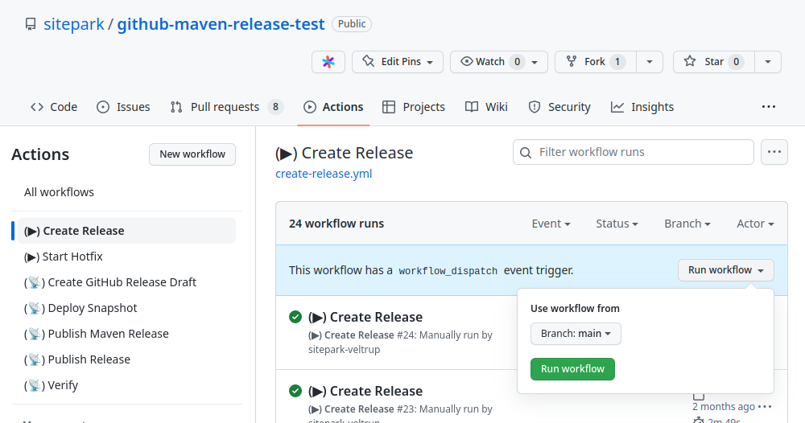
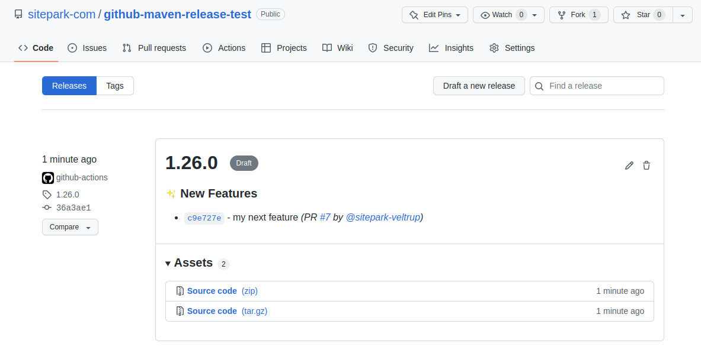
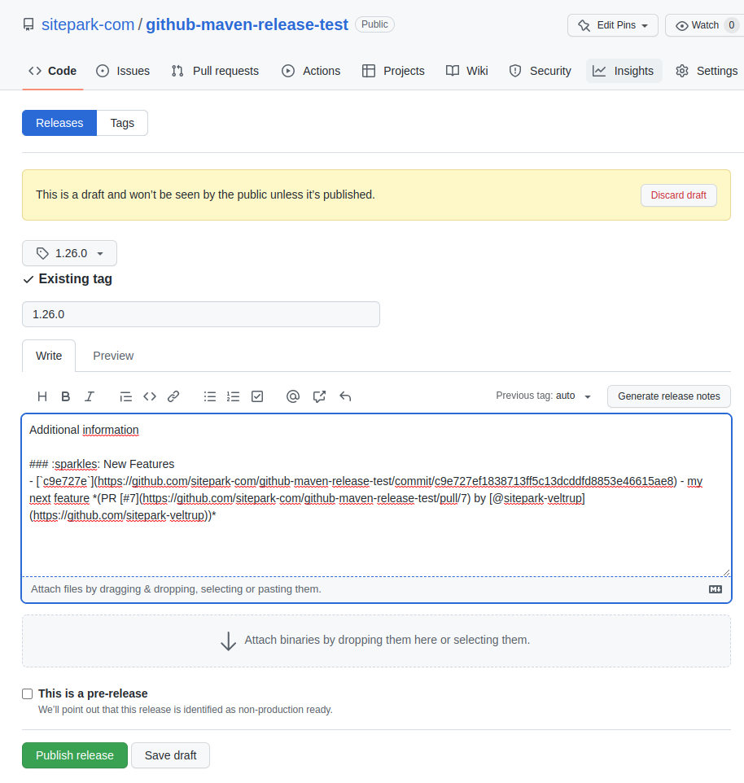

## GitHub Project Workflow

Lightweight release process with support for hotfixes and support releases.

Releases and hotfixes should be created as easily as possible. The starting point for this is a simple [Branching model](branching-model.md).

The changelogs are created based on the commits. The commits must adhere to the [commit-conventions](commit-conventions.md).

Version numbers are assigned according to the [Semantic Versioning](https://semver.org/) scheme.

### Create a release

A release is triggered via a GitHub action. The branch that is to be released is selected.

A release creates a new tag. Creating a tag triggers another GitHub action that creates a GitHub release draft.

This draft can be supplemented. Publishing the GitHub release triggers another GitHub action, which performs the necessary steps to publish the release.

The creation of the release is now finished.

### Create a main, hotfix and support-release

There are three types of releases. A main release, a hotifx release or a support release.

The main release must always be created with the `main` branch. A main release can be either a major or minor release.

To create a hotfix release, a hotfix branch must first be created. This can also be done via a provided GibHub Action. A Hotifx release always only increases the patch level of a previously released version.

To create a support release, a support branch must first be created. This is always created manually. A support release always only increases the minor level of a previously released version. A hotfix can be created from a support release in the same way as from a main release.

---
**NOTE**

All changes committed in a `hotfix` or `support` branch are **not** automatically applied to other branches such as the `main` branch, but must be applied with a `cherry-pick`.

It is important that there is **no** merge from the `hotix` branch to the `main` branch, as it is provided in other branching models.

---

### Setup Project

To use this workflow, the project must be set up accordingly. Depending on the project type, the corresponding Git actions are provided. The Git actions are available for the following project types.

* Maven projects
* (NPM projects are still to come)
* (Composer projects still to come)

The setup of the projects is described in [Project setup](project-setup.md).