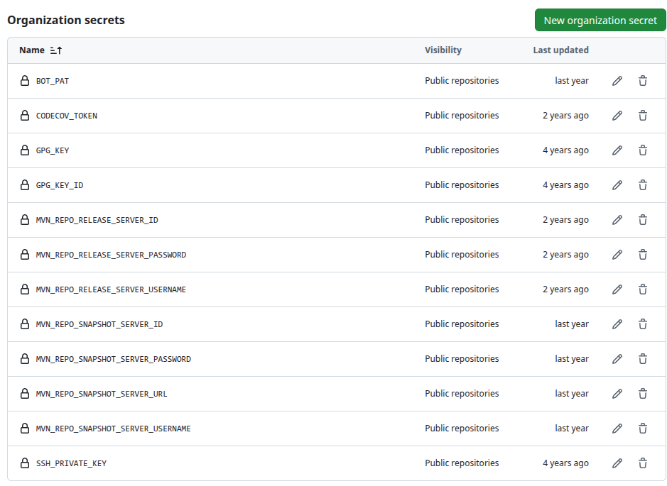

# Organisation setup

## Create a CI Bot

The CI bot is the GitHub user [`sitepark-bot`](https://github.com/sitepark-bot){:target="\_blank"}. It creates the releases and pushes the release commits and tags. The section [Setup a CI bot with GPG signature](https://github.com/gh-a-sample/github-actions-maven-release-sample#setup-a-ci-bot-with-gpg-signature){:target="\_blank"} describes how to create the CI bot.

Important points here are

- [Setup with SSH](https://github.com/qcastel/github-actions-maven-release#setup-with-ssh){:target="\_blank"}
- [Setup a GPG key](https://github.com/qcastel/github-actions-maven-release#setup-a-gpg-key){:target="\_blank"}

### Team `bots`

The `sitepark-bot` is the only member of the team [`bots`](https://github.com/orgs/sitepark/teams/bots){:target="\_blank"}. The projects grant their permissions to this team and not to the user directly, see [Manage access](project-setup.md#manage-access).

### Personal access token `BOT_PAT`

Create a [personal access token (classic)](https://docs.github.com/en/authentication/keeping-your-account-and-data-secure/managing-your-personal-access-tokens){:target="\_blank"} for the `sitepark-bot` and store it as the organization secret `BOT_PAT`. It is used by the release actions and by the [settings check](project-setup.md#settings-check).

| Scope       | Required for                                                    |
| ----------- | --------------------------------------------------------------- |
| `repo`      | release actions, settings check                                 |
| `read:org`  | settings check (reading the role of the team `bots`)            |
| `admin:org` | settings check in mode `apply`, only to correct the team roles  |

## Actions secrets

The following actions secrets are set on the organization:

| Secret                              | Used by                                                  |
| ----------------------------------- | -------------------------------------------------------- |
| `BOT_PAT`                           | release actions, settings check                          |
| `GPG_KEY`, `GPG_KEY_ID`             | Maven release (signing)                                  |
| `SSH_PRIVATE_KEY`                   | Maven release (push via SSH)                             |
| `CODECOV_TOKEN`                     | verify actions (code coverage upload)                    |
| `MVN_REPO_SNAPSHOT_SERVER_*`        | Maven snapshot deployment, see below                     |
| `MVN_REPO_RELEASE_SERVER_*`         | Maven release deployment, see below                      |

### Deploy Maven snapshot artifacts to the sitepark Maven repository

Snapshots are published in the Maven repository of Sitepark. The following action secrets must be set for this:

```
MVN_REPO_SNAPSHOT_SERVER_ID=sitepark
MVN_REPO_SNAPSHOT_SERVER_USERNAME=[USERNAME]
MVN_REPO_SNAPSHOT_SERVER_PASSWORD=[PASSWORD]
MVN_REPO_SNAPSHOT_SERVER_URL=https://nexus.sitepark.com/nexus/content/repositories/snapshots
```

### Deploy Maven release artifacts to the central Maven repository

The following page describes how to register an account:

- [https://central.sonatype.org/register/central-portal/](https://central.sonatype.org/register/central-portal/){:target="\_blank"}

A token must then be generated:

- [https://central.sonatype.org/publish/generate-portal-token/](https://central.sonatype.org/publish/generate-portal-token/){:target="\_blank"}

Once the token has been created, the following action secrets must be set:

```
MVN_REPO_RELEASE_SERVER_ID=central
MVN_REPO_RELEASE_SERVER_USERNAME=[TOKEN USERNAME]
MVN_REPO_RELEASE_SERVER_PASSWORD=[TOKEN]
```

### Verify settings

When all points are executed, the organization should contain the following actions secrets:



## Integrate Codecov GitHub App

For a good integration of the code coverage test, the Codecov GitHub app is set up. See [https://github.com/marketplace/codecov](https://github.com/marketplace/codecov){:target="\_blank"}

## Integrate Snyk GitHub App

To check the dependencies for vulnerabilities, the Snyk GitHub app is integrated. See [https://github.com/marketplace/snyk](https://github.com/marketplace/snyk){:target="\_blank"}
