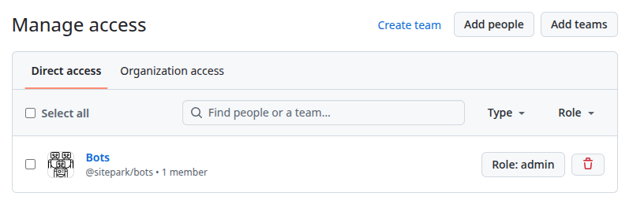
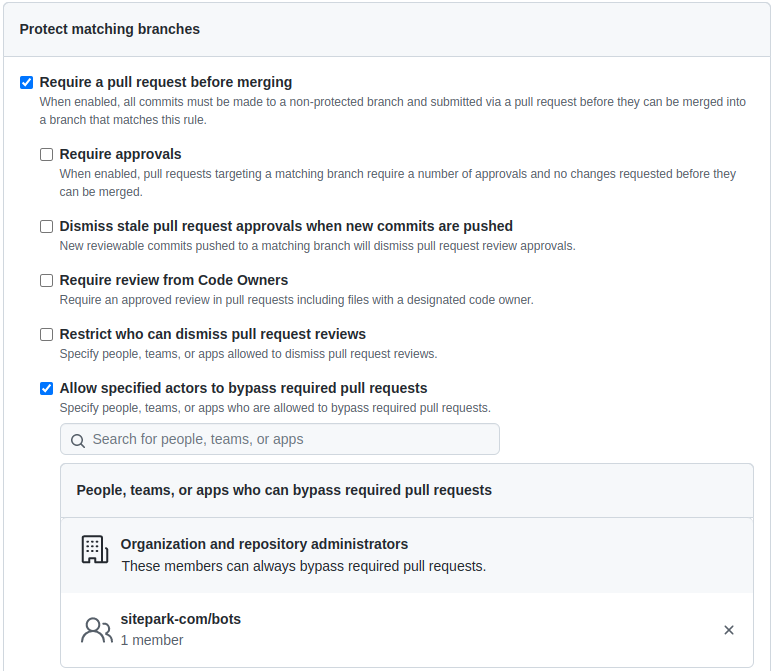
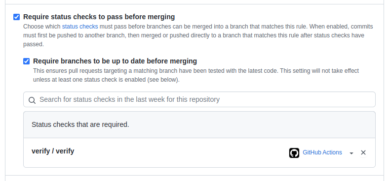

# Project setup

Depending on the project type, corresponding configurations within the project files are still necessary:

* [Setup for maven projects](project-setup-maven.md)

Below are the recommended settings for Github projects that are required to use this Github workflow.

## Secrets

Various Secrets are required for the necessary GitHub actions. If the projects are combined in a GibHub organization, the Secrets can be stored there centrally. The setup of the organization is described in [Organization Setup](organisation-setup.md).

If this concerns only a single project, follow the instructions under [Organization Setup](organisation-setup.md) with the difference that the Secrets are set directly on the project.

## Manage access

For automated actions, the [`sitepark-bot`](https://github.com/sitepark-bot) must have write access to the project.

## `main`-Branch settings

The default branch should be `main`.

### Branch protection

In the `main` branch should not be committed directly but always via a pull request. For this "Require a pull request before merging" should be set in the "Branch protection rules" to enforce this rule.

For automated actions, an exception must be defined to be able to execute a release process, for example. For this [`sitepark/bot`](https://github.com/sitepark-bot) is added as an exception.

Furthermore, branches should only be merged into the `main` branch if the GitHub action "Verify" could be executed successfully before.

Therefore the rules "Require status checks to pass before merging" and "Require branches to be up to date before merging" are activated.

The status check "verify /verify" still has to be added.

## GitHub Actions

To verify, deploy and release the projects, GibHub Actions must be defined.

Depending on the type of project (Java/Maven, JavaScript/NPM, PHP/Composer), the corresponding actions must be created here.

There is a naming convention for the actions, which states that the name of the actions that must be triggered manually should start with (▶) and actions that are triggered automatically should start with (📡).

### (▶) Create Release

The release action creates a new release for one of the branches `main`, `hotifx/*` or `support/*`. See also [branching model](branching-model.md). This action is project type specific. This is started manually.

To create this action for the project the file `.github/workflow/create-release.yml` must be created in the project.

For the different project types, the corresponding action must be used:

- [Maven Projects](https://github.com/sitepark/github-maven-release-test/blob/main/.github/workflows/create-release.yml)

### (▶) Start Hotfix

Creates a hotfix branch by specifying a version tag. This action is project type specific. It is started manually.

To create this action for the project the file `.github/workflow/start-hotfix.yml` must be created in the project.

For the different project types, the corresponding action must be used:

- [Maven Projects](https://github.com/sitepark/github-maven-release-test/blob/main/.github/workflows/start-hotfix.yml)

### (📡) Create GitHub Release Draft

When a new tag of the form `[0-9]+\.[0-9]+\.[0-9]+` has been created, this action is triggered automatically. It creates a new GitHub release as a draft and sets the changelog based on the Git commits.

To create this action for the project the file `.github/workflow/create-github-release-draft.yml` must be created in the project.

For the different project types, the corresponding action must be used:

- [Maven Projects](https://github.com/sitepark/github-maven-release-test/blob/main/.github/workflows/create-github-release-draft.yml)

### (📡) Deploy Snapshot

The build action is performed on each commit for the `main` branch only. The project is created, tested checked and built using defined rules such as code style conventions. Upon successful completion, the artifact is deployed to a snapshot repository.

To create this action for the project the file `.github/workflow/deploy-snapshot.yml` must be created in the project.

For the different project types, the corresponding action must be used:

- [Maven Projects](https://github.com/sitepark/github-maven-release-test/blob/main/.github/workflows/deploy-snapshot.yml)

### (📡) Publish Release

This action is started automatically when the GitHub release is published. This action is project type specific. For example, for a Maven project, the artifact is deployed to the central Maven repository.

To create this action for the project the file `.github/workflow/publish-release.yml` must be created in the project.

For the different project types, the corresponding action must be used:

- [Maven Projects](https://github.com/sitepark/github-maven-release-test/blob/main/.github/workflows/publish-release.yml)

### (📡) Verify

The verification action is performed on every commit for every branch except the `main` branch. The project is created, tested, and verified against defined rules, such as code style conventions.

To create this action for the project the file `.github/workflow/verify.yml` must be created in the project.

For the different project types, the corresponding action must be used:

- [Maven Projects](https://github.com/sitepark/github-maven-release-test/blob/main/.github/workflows/verify.yml)

## Dependabot

Use [Dependabot](https://docs.github.com/en/code-security/dependabot/dependabot-version-updates/about-dependabot-version-updates) to keep the packages you use updated to the latest versions.

For the different project types, the corresponding `.github/dependabot.yml` must be used:

- [Maven Projects](https://github.com/sitepark/github-maven-release-test/blob/main/.github/dependabot.yml)

Configure Dependabot "Settings -> Code security and analysis -> Dependabot"
