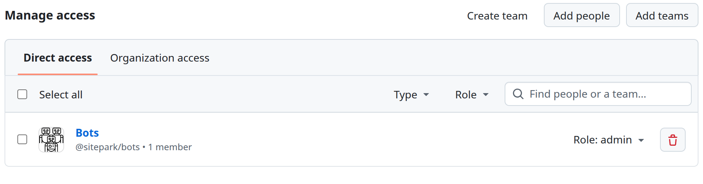
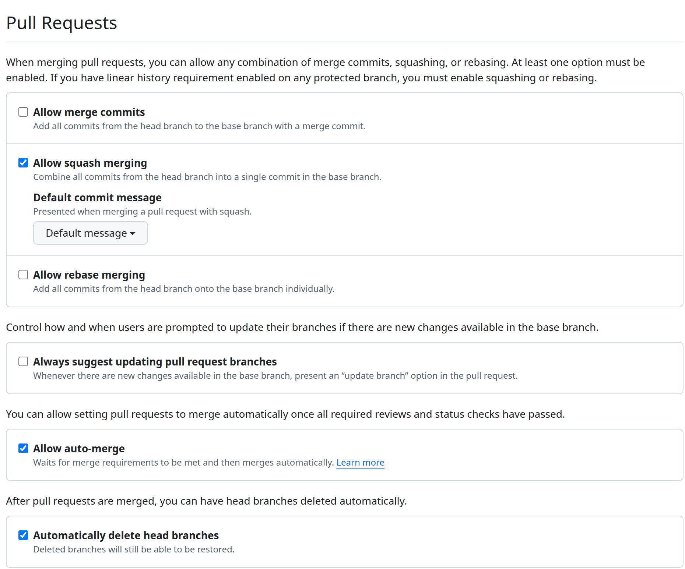
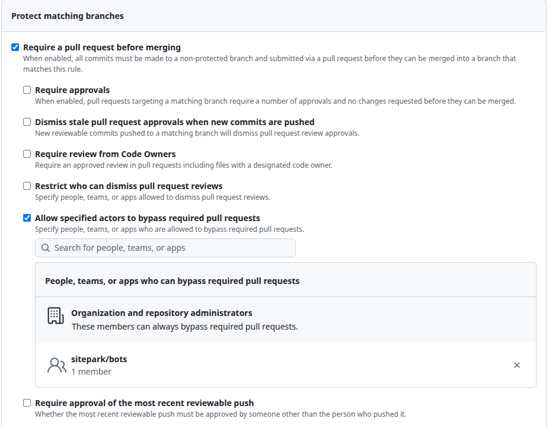
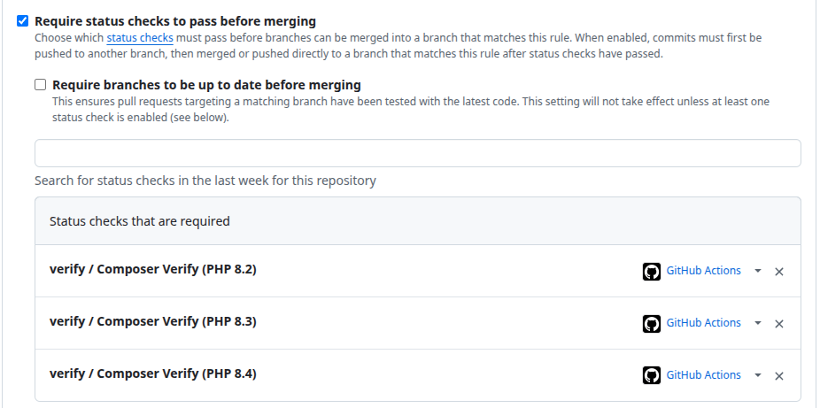

# Project setup

Depending on the project type, corresponding configurations within the project files are still necessary:

- [Setup for maven projects](project-setup-maven.md)

- [Setup for composer projects](project-setup-composer.md)

- [Setup for js projects](project-setup-js.md)

Below are the recommended settings for GitHub projects that are required to use this GitHub workflow.

!!! note "Settings check"

    For some groups of projects the settings described here are checked automatically every working day.
    See [Settings check](#settings-check). Please set up new projects of these groups exactly as described
    here, otherwise the check fails.

## Secrets

Various secrets are required for the necessary GitHub actions. If the projects are combined in a GitHub organization, the secrets can be stored there centrally. The setup of the organization is described in [Organization setup](organisation-setup.md).

If this concerns only a single project, follow the instructions under [Organization setup](organisation-setup.md) with the difference that the secrets are set directly on the project.

## Manage access

For automated actions, the team [`bots`](https://github.com/orgs/sitepark/teams/bots){:target="\_blank"} must have access to the project. The only member of this team is the [`sitepark-bot`](https://github.com/sitepark-bot){:target="\_blank"}.

| Project type | Role of team `bots` |
| ------------ | ------------------- |
| Maven, JS    | **write**           |
| Composer     | **admin**           |

The write role is required, because the release actions push to the protected `main` branch, for which the team is a [bypass actor](#require-a-pull-request-before-merging). Composer projects require the admin role, because the `sitepark-bot` manages the packagist.org webhook of the project, see [Setup for composer projects](project-setup-composer.md#manage-access).

_Settings → Collaborators and teams → Add teams_



## General settings

_Settings → General_

The default branch should be `main`.

Under _Pull Requests_ the following options are set:

| Option                                        | Value |
| --------------------------------------------- | ----- |
| Allow merge commits                           | off   |
| Allow squash merging                          | on    |
| Allow rebase merging                          | off   |
| Always suggest updating pull request branches | off   |
| Allow auto-merge                              | on    |
| Automatically delete head branches            | on    |

Pull requests are always merged with squash, so that each pull request results in exactly one commit on `main` whose message follows the [commit conventions](commit-conventions.md).

"Allow auto-merge" is required for the action [(📡) Auto-Merge Dependabot Minor Updates](#auto-merge-dependabot-minor-updates).



## `main`-Branch protection

_Settings → Branches → Branch protection rules → `main`_

### Require a pull request before merging

The `main` branch should not be committed to directly, but always via a pull request. For this, "Require a pull request before merging" is enabled.

- "Require approvals" is **disabled**, so that Dependabot updates can be merged automatically.
- Under "Allow specified actors to bypass required pull requests" the team **`bots`** is added. This exception is required so that the release actions can push to `main`.

!!! warning

    GitHub only accepts a team as a bypass actor if the team has at least write access to the project
    (see [Manage access](#manage-access)). Otherwise the entry is dropped silently when saving.



### Require status checks to pass before merging

Branches should only be merged into the `main` branch if the GitHub action "Verify" has been executed successfully before. For this, "Require status checks to pass before merging" is enabled.

"Require branches to be up to date before merging" is **disabled**.

The status checks to be added depend on the project type:

| Project type | Required status checks                                                                                                   |
| ------------ | ------------------------------------------------------------------------------------------------------------------------ |
| Maven        | `verify / verify`                                                                                                        |
| Composer     | `verify / Composer Verify (PHP x.y)` for each PHP version in `phpVersions` of the `verify.yml`, e.g. `8.2`, `8.3`, `8.4` |
| JS           | `verify / verify`                                                                                                        |

A status check can only be added after the action has run at least once in the project.



### Further rules

"Allow force pushes" and "Allow deletions" stay **disabled**.

## Security

_Settings → Advanced Security_

"Dependabot alerts" (vulnerability alerts) is **enabled**.

"Dependabot security updates" creates pull requests for vulnerable dependencies automatically. It is **enabled** for the `ies-*` projects and **disabled** for the `atoolo-*` projects.

See also [Dependabot](#dependabot).

## GitHub Actions

To verify, deploy and release the projects, GitHub Actions must be defined.

Depending on the type of project (Java/Maven, JavaScript/NPM, PHP/Composer), the corresponding actions must be created here.

There is a naming convention for the actions, which states that the name of the actions that must be triggered manually should start with (▶) and actions that are triggered automatically should start with (📡).

### (▶) Create Release

The release action creates a new release for one of the branches `main`, `hotfix/*` or `support/*`. See also [branching model](branching-model.md). This action is project type specific. It is started manually.

To create this action for the project the file `.github/workflows/create-release.yml` must be created in the project.

For the different project types, the corresponding action must be used:

- [Maven Projects](https://github.com/sitepark/github-maven-release-test/blob/main/.github/workflows/create-release.yml){:target="\_blank"}
- [Composer Projects](https://github.com/sitepark/github-composer-release-test/blob/main/.github/workflows/create-release.yml){:target="\_blank"}
- [JS Projects](https://github.com/sitepark/github-js-release-test/blob/main/.github/workflows/create-release.yml){:target="\_blank"}

### (▶) Start Hotfix

Creates a hotfix branch by specifying a version tag. This action is project type specific. It is started manually.

To create this action for the project the file `.github/workflows/start-hotfix.yml` must be created in the project.

For the different project types, the corresponding action must be used:

- [Maven Projects](https://github.com/sitepark/github-maven-release-test/blob/main/.github/workflows/start-hotfix.yml){:target="\_blank"}
- [Composer Projects](https://github.com/sitepark/github-composer-release-test/blob/main/.github/workflows/start-hotfix.yml){:target="\_blank"}
- [JS Projects](https://github.com/sitepark/github-js-release-test/blob/main/.github/workflows/start-hotfix.yml){:target="\_blank"}

### (📡) Create GitHub Release Draft

When a new tag of the form `[0-9]+\.[0-9]+\.[0-9]+` has been created, this action is triggered automatically. It creates a new GitHub release and sets the changelog based on the Git commits.

To create this action for the project the file `.github/workflows/create-github-release.yml` must be created in the project.

For the different project types, the corresponding action must be used:

- [All Projects](https://github.com/sitepark/github-maven-release-test/blob/main/.github/workflows/create-github-release.yml){:target="\_blank"}

### (📡) Deploy Snapshot

The build action is performed on each commit for the `main` branch only. The project is built, tested and checked using defined rules such as code style conventions. Upon successful completion, the artifact is deployed to a snapshot repository.

To create this action for the project the file `.github/workflows/deploy-snapshot.yml` must be created in the project.

For the different project types, the corresponding action must be used:

- [Maven Projects](https://github.com/sitepark/github-maven-release-test/blob/main/.github/workflows/deploy-snapshot.yml){:target="\_blank"}

### (📡) Verify

The verification action is performed on every commit for every branch except the `main` branch. The project is built, tested, and verified against defined rules, such as code style conventions.

To create this action for the project the file `.github/workflows/verify.yml` must be created in the project.

For the different project types, the corresponding action must be used:

- [Maven Projects](https://github.com/sitepark/github-maven-release-test/blob/main/.github/workflows/verify.yml){:target="\_blank"}
- [Composer Projects](https://github.com/sitepark/github-composer-release-test/blob/main/.github/workflows/verify.yml){:target="\_blank"}
- [JS Projects](https://github.com/sitepark/github-js-release-test/blob/main/.github/workflows/verify.yml){:target="\_blank"}

The jobs of this action are the status checks required in the [branch protection](#require-status-checks-to-pass-before-merging).

### (📡) Auto-Merge Dependabot Minor Updates

This action is triggered automatically when a pull request from Dependabot is created. It automatically merges minor updates into the `main` branch if the verification action succeeds.

To enable this action in the project, create the file `.github/workflows/dependabot-automerge-minor.yml`.

It requires the following settings described above:

- "Allow auto-merge" is enabled ([General settings](#general-settings)).
- "Require status checks to pass before merging" is enabled and "Require approvals" is disabled ([`main`-Branch protection](#main-branch-protection)).

For all project types:

- [All Projects](https://github.com/sitepark/github-maven-release-test/blob/main/.github/workflows/dependabot-automerge-minor.yml){:target="\_blank"}

## Dependabot

Use [Dependabot](https://docs.github.com/en/code-security/dependabot/dependabot-version-updates/about-dependabot-version-updates){:target="\_blank"} to keep the packages you use updated to the latest versions.

For the different project types, the corresponding `.github/dependabot.yml` must be used:

- [Maven Projects](https://github.com/sitepark/github-maven-release-test/blob/main/.github/dependabot.yml){:target="\_blank"}
- [Composer Projects](https://github.com/sitepark/github-composer-release-test/blob/main/.github/dependabot.yml){:target="\_blank"}
- [JS Projects](https://github.com/sitepark/github-js-release-test/blob/main/.github/dependabot.yml){:target="\_blank"}

## Settings check

The workflow [`(🔍) Check repository settings`](https://github.com/sitepark/github-project-workflow/actions/workflows/check-repo-settings.yml){:target="\_blank"} of this project compares the settings of groups of projects with a target configuration every working day. Each file in [`repo-settings/`](https://github.com/sitepark/github-project-workflow/tree/main/repo-settings){:target="\_blank"} describes one group:

| File                                                                                                                      | Projects                |
| ------------------------------------------------------------------------------------------------------------------------- | ----------------------- |
| [`atoolo.json`](https://github.com/sitepark/github-project-workflow/blob/main/repo-settings/atoolo.json){:target="\_blank"} | all `atoolo-*` projects |
| [`ies.json`](https://github.com/sitepark/github-project-workflow/blob/main/repo-settings/ies.json){:target="\_blank"}       | all `ies-*` projects    |

A group covers new projects automatically as soon as their name matches the pattern of the group. The following settings are checked:

- the options of the [General settings](#general-settings)
- the vulnerability alerts and, if configured, the Dependabot security updates ([Security](#security))
- the role of the team `bots` ([Manage access](#manage-access))
- the complete [`main`-Branch protection](#main-branch-protection)

Deviations are only reported: the run fails and lists every deviation in the job summary. To correct them, start the workflow manually with the mode `apply`.

Projects that deliberately differ from their group, e.g. because they have no verify action, are configured in the `overrides` of the group file. Projects that should not be checked at all are listed in `exclude`.

The check can also be run locally:

```sh
GH_TOKEN=$(gh auth token) scripts/check-repo-settings.sh repo-settings/atoolo.json
```

The token requires the scopes `repo` and `read:org`. To correct the role of a team with `--apply`, it additionally requires `admin:org`.
